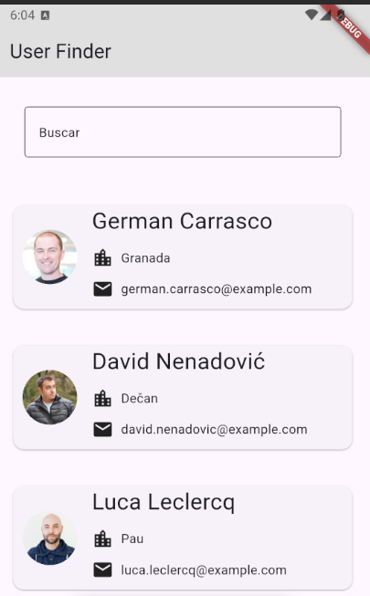

# User Finder

App desarrollada en Flutter que consume una API para mostrar una lista de usuarios y permite realizar búsquedas en tiempo real.

## 🚀 Features

- Consumo de API con HTTP
- Listado dinámico de usuarios
- Navegación a pantalla de detalle
- Buscador en tiempo real
- Interfaz simple y funcional

## 📸 Screenshots

